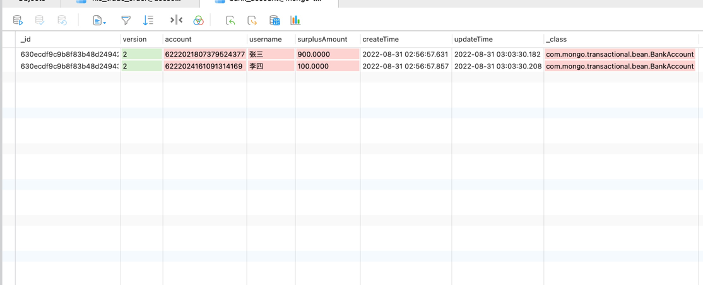

# springboot 集成 mongodb （使用事务 | 读写分离）
事务读写分离都需要副本集模式才能使用，副本集搭建参考我的文章：[Linux 之 MongoDB副本集安装与配置](https://blog.csdn.net/weixin_40863968/article/details/126631015)

## 配置mongodb数据源 application.properties
```properties
spring.data.mongodb.uri=mongodb://[username:password@]host1[:port1][,host2[:port2]/
# 开启读写分离后不支持事务 slaveOk=true
# spring.data.mongodb.uri=mongodb://[username:password@]host1[:port1][,host2[:port2]/?slaveOk=true&replicaSet=rs&write=1&readPreference=secondaryPreferred
spring.data.mongodb.database=mongo-transactional
spring.data.mongodb.authentication-database=admin
```
### 标准 URI 连接语法
```
mongodb://[username:password@]host1[:port1][,host2[:port2],...[,hostN[:portN]]][/[database][?options]]
```
#### [username]:[password]@
```
可选项，如果设置，在连接数据库服务器之后，驱动都会尝试登录这个数据库
```
#### [host]
```
必须的指定至少一个host, host1 是这个URI唯一要填写的。它指定了要连接服务器的地址。如果要连接复制集，请指定多个主机地址
```
#### [port]
```
可选的指定端口，如果不填，默认为27017
```
### options
#### replicaSet=name 选项
```
指定replicaSet=name后则为replicaSet模式，并指定replicaSet名称
```
#### slaveOk  选项
```
replicaSet模式下，驱动会发送所有的写请求到主并且把读取操作分布在其他从服务器
```
#### readPreference 选项
```
(1) primary：只主(默认模式)。只从primary节点读数据。

(2) primaryPreferred：先主后从。优先从primary读取，primary不可用时从secondary读。

(3) secondary：只从。只从副本集中secondary节点读数据。

(4) secondaryPreferred：先从后主。优先从secondary读取，如果secondary不可用时就从primary读。

(5) nearest：就近。根据网络距离，就近读取，根据客户端与服务端的PingTime是实现。
```
## 配置事务管理器
```java
/**
 * @author shanlingshi
 * @since 2021-09-03
 */
@Configuration
public class MongoDBConfiguration {

    @Bean
    public MongoTransactionManager transactionManager(MongoDatabaseFactory mongoDatabaseFactory) {
        return new MongoTransactionManager(mongoDatabaseFactory);
    }

}
```
## 启动类
```java
/**
 * @author shanlingshi
 * @since 2022-08-30
 */
@EnableMongoAuditing
@EnableTransactionManagement
@SpringBootApplication(scanBasePackages = "com.springboot.mongodb")
public class MongoTransactionalApplication {

    public static void main(String[] args) {

        SpringApplication.run(MongoTransactionalApplication.class, args);
    }

}
```
### @EnableMongoAuditing 
启用审计功能，为了使用 @CreateDate | @LastModifiedDate
```java
/**
 * @author shanlingshi
 * @since 2021-09-03
 */
@Getter
@Setter
@Document("bank_account")
public class BankAccount implements Serializable {

    private static final long serialVersionUID = 7665190409172218778L;
    @Id
    private String id;

    @Version
    private Integer version;

    private String account;

    private String username;

    private BigDecimal surplusAmount;

    @CreatedDate
    private LocalDateTime createTime;

    @LastModifiedDate
    private LocalDateTime updateTime;

}
```
### @EnableTransactionManagement
启用事务

## MongoTemplate
```java
/**
 * @author shanlingshi
 * @since 2021-09-03
 */
@Component
public class BankAccountService {

    @Resource
    private MongoTemplate mongoTemplate;

    public void init(BankAccount bankAccount) {

        mongoTemplate.insert(bankAccount);
    }

    public BankAccount oneByAccount(String account) {
        Criteria criteria = new Criteria();
        criteria.and("account").is(account);

        return mongoTemplate.findOne(new Query(criteria), BankAccount.class);
    }

    public void update(BankAccount bankAccount) {

        mongoTemplate.save(bankAccount);
    }

}
```

## 事务核心操作类
```java
/**
 * @author shanlingshi
 * @since 2021-09-03
 */
@Component
public class BankAccountCore {

    @Resource
    private BankAccountService bankAccountService;

    @Transactional
    public void create(CreateAccount createAccount) {
        BankAccount bankAccount = new BankAccount();
        bankAccount.setAccount(createAccount.getAccount());
        bankAccount.setUsername(createAccount.getUsername());
        bankAccount.setSurplusAmount(createAccount.getSurplusAmount());

        bankAccountService.init(bankAccount);
    }

    @Transactional
    public void transfer(String sourceAccount, String targetAccount, BigDecimal amount) {
        BankAccount source = bankAccountService.oneByAccount(sourceAccount);
        BankAccount target = bankAccountService.oneByAccount(targetAccount);

        if (source.getSurplusAmount().compareTo(amount) < 0) {
            throw new RuntimeException("Sorry, your credit is running low");
        }

        source.setSurplusAmount(source.getSurplusAmount().subtract(amount).setScale(4, RoundingMode.CEILING));
        bankAccountService.update(source);
        // 打开注释测试事务
//        if (1 == 1) {
//            throw new RuntimeException("Bank account transfer failed");
//        }

        target.setSurplusAmount(target.getSurplusAmount().add(amount).setScale(4, RoundingMode.CEILING));
        bankAccountService.update(target);
        // 打开注释测试事务
//        if (1 == 1) {
//            throw new RuntimeException("Bank account transfer failed");
//        }
    }

}
```

## SpringBootTest
```java
/**
 * 测试
 */
@RunWith(SpringRunner.class)
@SpringBootTest(classes = MongoTransactionalApplication.class)
public class ApplicationTests {

    @Resource
    private BankAccountCore bankAccountCore;

    /**
     * 测试增删改查
     */
    @Test
    public void create() {
        CreateAccount zhangsan = new CreateAccount();
        zhangsan.setAccount("6222021807379524377");
        zhangsan.setUsername("张三");
        zhangsan.setSurplusAmount(BigDecimal.valueOf(1000).setScale(4, RoundingMode.CEILING));
        bankAccountCore.create(zhangsan);

        CreateAccount lisi = new CreateAccount();
        lisi.setAccount("6222024161091314169");
        lisi.setUsername("李四");
        bankAccountCore.create(lisi);
    }

    /**
     * 测试增删改查
     */
    @Test
    public void transfer() {
        // 张三
        String sourceAccount = "6222021807379524377";
        // 李四
        String targetAccount = "6222024161091314169";
        // 转账金额
        BigDecimal transferAmount = BigDecimal.valueOf(50).setScale(4, RoundingMode.CEILING);

        bankAccountCore.transfer(sourceAccount, targetAccount, transferAmount);
    }

}
```

## 数据结果，执行两次 ApplicationTests # transfer() 的结果

